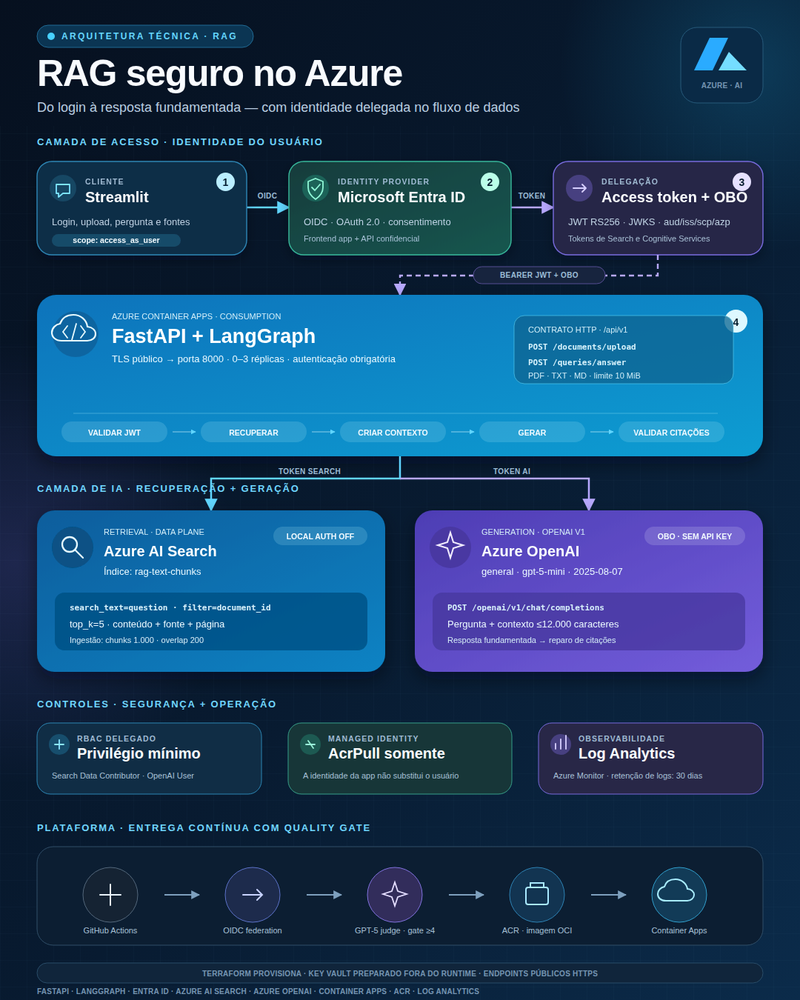

<div align="center">

# RAG Knowledge Assistant on Azure

**Asistente para consultar manuales con respuestas fundamentadas, citas verificables y seguridad basada en Microsoft Entra ID.**

[](https://www.python.org/)
[](https://fastapi.tiangolo.com/)
[](https://azure.microsoft.com/)
[](https://www.terraform.io/)
[](https://github.com/efraxpc/rag-knowledge-assistant-azure/actions/workflows/quality-gate-deploy.yml)

[Inicio rápido](#inicio-rápido) · [Arquitectura](#arquitectura) · [API](#api) · [Documentación](#documentación)

</div>

---

Este proyecto implementa un flujo **Retrieval-Augmented Generation (RAG)** de
extremo a extremo sobre Azure. Permite cargar documentos, recuperar los
fragmentos más relevantes y generar una respuesta usando exclusivamente el
contexto encontrado. Cada respuesta conserva las fuentes utilizadas y el flujo
se abstiene cuando los manuales no contienen información suficiente.

La solución incluye una interfaz conversacional con Streamlit, una API FastAPI,
orquestación con LangGraph, Azure AI Search, Azure OpenAI, autenticación delegada
con Entra ID, infraestructura Terraform y un quality gate basado en evaluación
LLM.

## Vista general

<p align="center">
  <a href="docs/diagrams/linkedin/azure-rag-architecture-linkedin.png">
    
  </a>
</p>

## Funcionalidades

- Interfaz de chatbot con inicio de sesión mediante Microsoft Entra ID.
- Carga de archivos PDF con texto, TXT y Markdown de hasta 10 MiB.
- Extracción, fragmentación e indexación del contenido en Azure AI Search.
- Preguntas sobre todos los manuales o sobre un documento específico.
- Generación con Azure OpenAI limitada al contexto recuperado.
- Citas por fuente y página, con validación y una reparación controlada.
- Segundo intento de recuperación mediante simplificación de la consulta.
- Listado de documentos y eliminación lógica de todos sus fragmentos.
- API REST documentada con Swagger y ReDoc.
- Infraestructura como código con Terraform y acceso mediante RBAC.
- Pipeline con tests, lint, evaluación RAG y despliegue condicionado por calidad.

> [!NOTE]
> La eliminación es lógica: los fragmentos reciben `deleted_at` y dejan de
> aparecer en búsquedas y listados, pero no se borran físicamente del índice.

## Cómo funciona

1. El usuario inicia sesión en Streamlit mediante Entra ID.
2. FastAPI valida el JWT y usa On-Behalf-Of para acceder a los servicios de
   Azure con la identidad delegada del usuario.
3. El documento se divide en fragmentos y se guarda en Azure AI Search.
4. LangGraph recupera el contexto relevante para la pregunta.
5. Azure OpenAI genera una respuesta exclusivamente con esos fragmentos.
6. El grafo comprueba las citas y repara o rechaza respuestas no confiables.

Si la primera búsqueda no encuentra contexto, el grafo puede simplificar la
consulta y buscar una vez más. Si aun así no hay evidencia suficiente, responde
de forma segura sin inventar información.

## Arquitectura

| Capa | Tecnología | Responsabilidad |
|---|---|---|
| Interfaz | Streamlit | Chat, autenticación, carga y administración de manuales |
| API | FastAPI + Pydantic | Contratos HTTP, validación y servicios de aplicación |
| Orquestación | LangGraph | Retrieval, contexto, generación y control de citas |
| Recuperación | Azure AI Search | Índices textual y vectorial opcional |
| Generación | Azure OpenAI | Respuestas RAG y evaluación de calidad |
| Identidad | Microsoft Entra ID | OIDC, JWT, On-Behalf-Of y acceso delegado |
| Runtime | Azure Container Apps | Ejecución de la API con escalado administrado |
| Entrega | GitHub Actions + ACR | Quality gate, imagen OCI y despliegue inmutable |
| Infraestructura | Terraform | Recursos Azure, identidades, roles e índices |

La arquitectura aplica mínimo privilegio: el pipeline usa identidades separadas
para `evaluation` y `production`, mientras que las solicitudes de la aplicación
usan la identidad del usuario y no una clave compartida de Search u OpenAI.

## Inicio rápido

### Requisitos

- Python 3.11 o superior.
- Una cuenta de Azure para ejecutar el flujo RAG completo.
- Azure CLI y Terraform para preparar la infraestructura.
- Un registro de aplicaciones en Entra ID para usar la interfaz autenticada.

### 1. Preparar el entorno

```bash
git clone https://github.com/efraxpc/rag-knowledge-assistant-azure.git
cd rag-knowledge-assistant-azure

python -m venv .venv
source .venv/bin/activate
pip install -e ".[dev]"
cp .env.example .env
```

### 2. Configurar Azure

Completa en `.env` los recursos que utilizará la aplicación:

```dotenv
APP_AZURE_SEARCH_ENDPOINT="https://<servicio>.search.windows.net"
APP_AZURE_SEARCH_TEXT_INDEX_NAME="rag-text-chunks"

APP_AZURE_OPENAI_ENDPOINT="https://<recurso>.cognitiveservices.azure.com"
APP_AZURE_OPENAI_CHAT_DEPLOYMENT="<deployment-generador>"

APP_ENTRA_TENANT_ID="<tenant-id>"
APP_ENTRA_API_CLIENT_ID="<client-id-api>"
APP_ENTRA_API_CLIENT_SECRET="<secreto-api>"
APP_ENTRA_FRONTEND_CLIENT_ID="<client-id-streamlit>"
```

Las cuatro variables `APP_ENTRA_*` se configuran conjuntamente. No confirmes el
archivo `.env`, secretos, tokens ni archivos de estado de Terraform en Git.
Consulta la [guía de autenticación](docs/entra-auth.md) para registrar la API y
el frontend, configurar OBO y asignar los permisos necesarios.

### 3. Iniciar la aplicación

```bash
./scripts/run_local.sh
```

Cuando ambos servicios estén listos:

- Chat: <http://localhost:8501>
- Swagger UI: <http://localhost:8000/docs>
- ReDoc: <http://localhost:8000/redoc>
- Health check: <http://localhost:8000/api/v1/health>

Para reiniciar la API y la interfaz, liberando primero sus puertos:

```bash
./scripts/run_local.sh restart
```

También puedes cambiar los puertos:

```bash
RAG_API_PORT=8080 RAG_UI_PORT=8502 ./scripts/run_local.sh
```

## Uso

Desde la interfaz web:

1. Inicia sesión con Microsoft.
2. Carga un PDF, TXT o Markdown y selecciona **Procesar y guardar**.
3. Elige el documento que quieres consultar.
4. Escribe una pregunta en el chat.
5. Revisa la respuesta, las citas y los fragmentos recuperados.

También puedes llamar a la API con un token destinado al registro de FastAPI.

### Cargar un documento

```bash
curl -X POST http://localhost:8000/api/v1/documents/upload \
  -H "Authorization: Bearer ${ACCESS_TOKEN}" \
  -F "file=@manual.pdf"
```

### Hacer una pregunta

```bash
curl -X POST http://localhost:8000/api/v1/queries/answer \
  -H "Authorization: Bearer ${ACCESS_TOKEN}" \
  -H "Content-Type: application/json" \
  -d '{
    "question": "¿Qué mantenimiento requiere el equipo?",
    "document_id": "<document-id>",
    "top_k": 5
  }'
```

Ejemplo abreviado de respuesta:

```json
{
  "answer": "El mantenimiento debe realizarse cada seis meses [manual.pdf, p. 12].",
  "context": [
    {
      "id": "page-12-chunk-1",
      "document_id": "<document-id>",
      "content": "...",
      "source": "manual.pdf",
      "page": 12,
      "score": 8.42
    }
  ]
}
```

## API

Todos los endpoints usan el prefijo `/api/v1`.

| Método | Endpoint | Descripción |
|---|---|---|
| `GET` | `/health` | Comprueba el estado de la API |
| `POST` | `/documents/upload` | Extrae, fragmenta e indexa un archivo |
| `GET` | `/documents` | Lista los documentos activos |
| `DELETE` | `/documents/{document_id}` | Aplica soft delete al documento y sus chunks |
| `POST` | `/queries/answer` | Recupera contexto y genera una respuesta citada |
| `POST` | `/documents/chunks` | Indexa chunks con embeddings precalculados |
| `POST` | `/queries/search` | Ejecuta búsqueda vectorial opcional |

Salvo el health check, las operaciones requieren un bearer token válido cuando
Entra ID está configurado. Los esquemas completos están disponibles en Swagger.

## Pruebas y calidad

Las pruebas son deterministas y no necesitan conectarse a recursos reales de
Azure:

```bash
pytest
ruff check .
ruff format --check .
```

El workflow de GitHub Actions ejecuta:

```text
tests + lint
    → indexar el corpus de evaluación
    → generar respuestas con el RAG candidato
    → evaluar groundedness, relevance, completeness y citation quality
    → construir la imagen en ACR
    → desplegar en Azure Container Apps
```

El despliegue solo continúa si todos los casos alcanzan el umbral configurado.
GitHub se autentica en Azure mediante OIDC, sin secretos de cliente permanentes.
La configuración completa está en la
[guía LLM-as-a-judge](docs/llm-as-a-judge.md).

## Infraestructura

Terraform administra Azure AI Search, los índices, identidades, asignaciones
RBAC, deployments de Azure OpenAI, observabilidad y la configuración de
Container Apps.

```bash
cd infrastructure/terraform
cp terraform.tfvars.example terraform.tfvars
terraform init
terraform fmt -check
terraform validate
terraform plan
```

Revisa siempre el plan antes de aplicarlo. Algunos recursos, como la cuenta de
Azure AI Services y el ACR, se integran como recursos preexistentes. Consulta el
[README de infraestructura](infrastructure/terraform/README.md) antes de hacer
cambios en Azure.

## Estructura del repositorio

```text
app/
├── api/              # Endpoints FastAPI versionados
├── commands/         # Preparación de índices y evaluación
├── core/             # Configuración, autenticación y errores
├── evaluation/       # Contratos y lógica del quality gate
├── integrations/     # Clientes de Azure Search y Azure OpenAI
├── rag/              # Modelos y contratos del dominio
├── schemas/          # Esquemas HTTP con Pydantic
├── services/         # Ingesta, retrieval y generación
├── main.py           # Aplicación FastAPI
└── streamlit_app.py  # Interfaz conversacional

evaluations/          # Corpus y escenarios de evaluación
infrastructure/       # Infraestructura Azure con Terraform
docs/                 # Guías y diagramas técnicos
tests/                # Pruebas automatizadas
```

## Documentación

| Tema | Documento |
|---|---|
| Flujo RAG y decisiones de LangGraph | [Flujo LangGraph](docs/langgraph-flow.md) |
| Carga, chunking y soft delete | [Ingesta de documentos](docs/file-ingestion.md) |
| Microsoft Entra ID, JWT y OBO | [Autenticación delegada](docs/entra-auth.md) |
| Índice y búsqueda vectorial opcional | [Vector store](docs/vector-store.md) |
| Evaluación y quality gate | [LLM-as-a-judge](docs/llm-as-a-judge.md) |
| Identidades OIDC del pipeline | [GitHub OIDC](docs/github-oidc-identities.mmd) |
| Infraestructura Azure | [Terraform](infrastructure/terraform/README.md) |
| Vista técnica imprimible | [Arquitectura A4](docs/diagrams/arquitectura/arquitectura-a4.pdf) |
| Flujo técnico completo | [Diagrama técnico A4](docs/diagrams/flujo-tecnico/flujo-tecnico-a4.pdf) |

## Alcance actual

- La recuperación principal es textual; el contrato vectorial acepta embeddings
  precalculados, pero la aplicación todavía no los genera.
- Los PDF deben contener texto extraíble. Los documentos escaneados necesitan
  OCR antes de cargarse.
- El archivo original no se almacena: solo se indexan sus fragmentos.
- El soft delete no incluye restauración ni purga automática.

---

<div align="center">

Construido con FastAPI, LangGraph y servicios administrados de Azure para
mostrar un RAG seguro, observable y evaluable de extremo a extremo.

</div>
